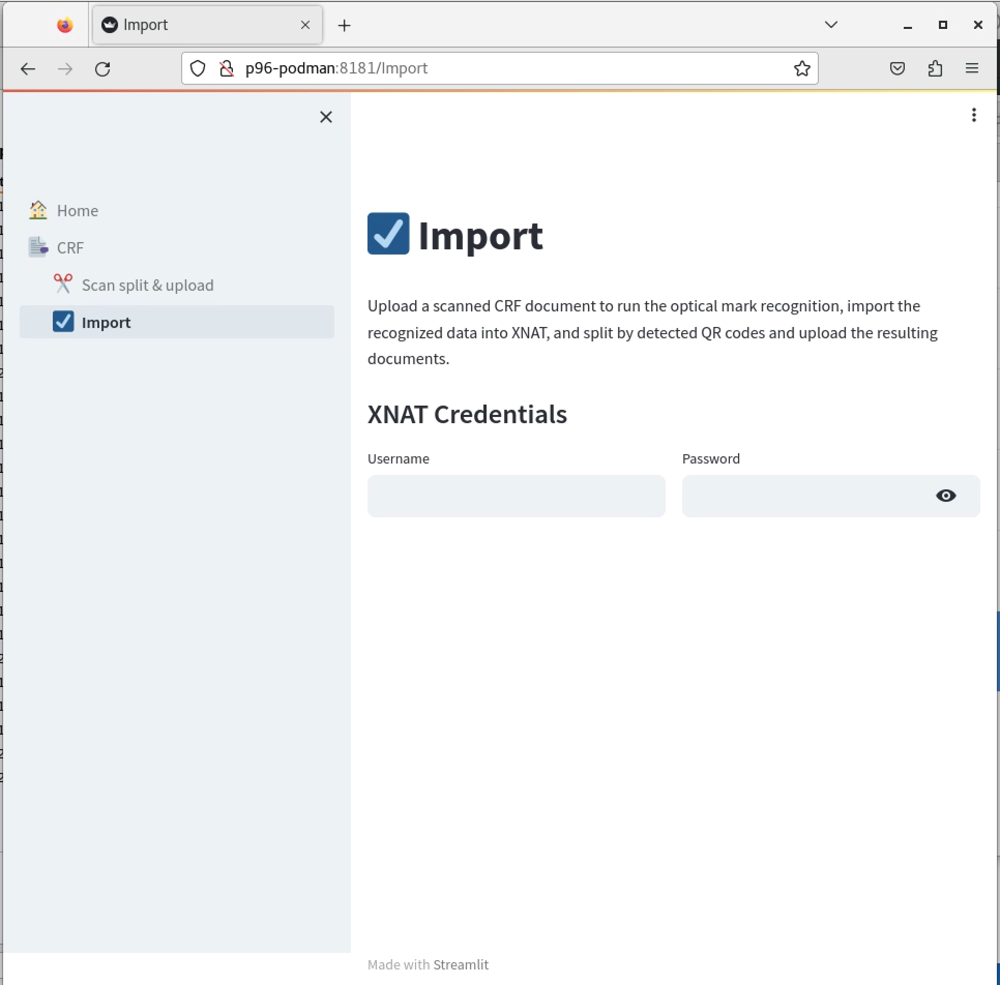
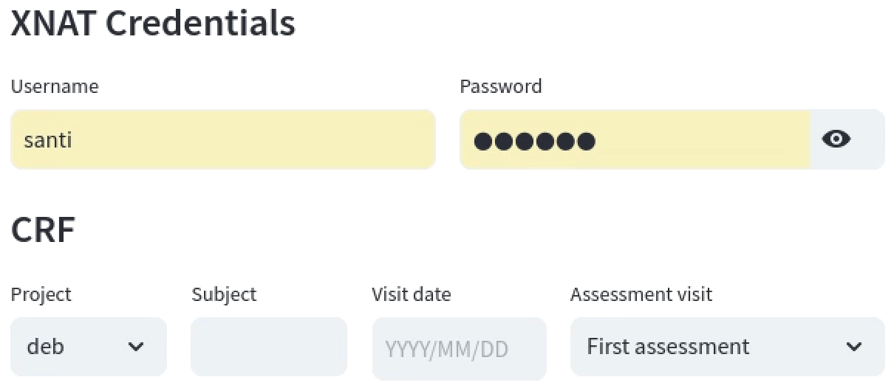
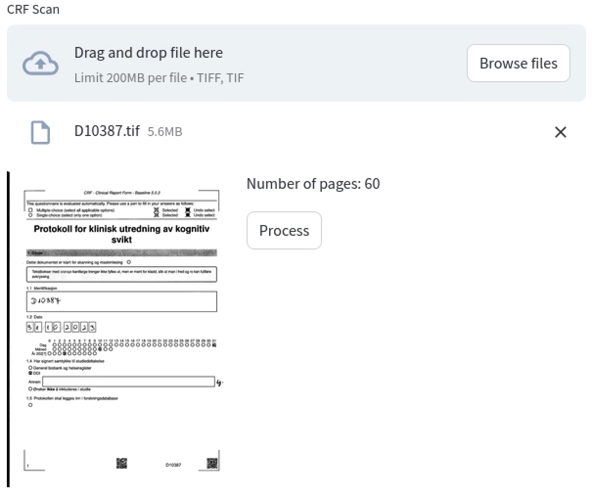
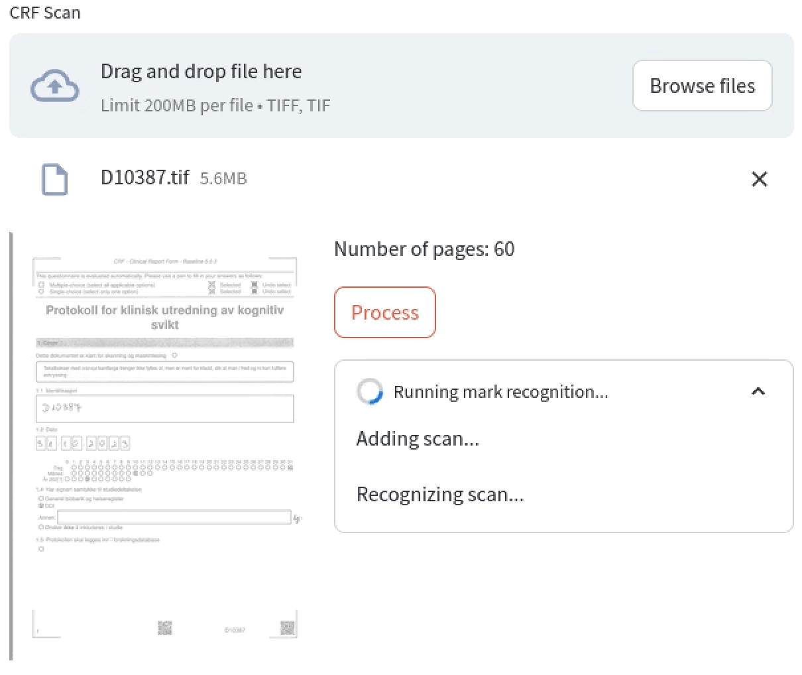
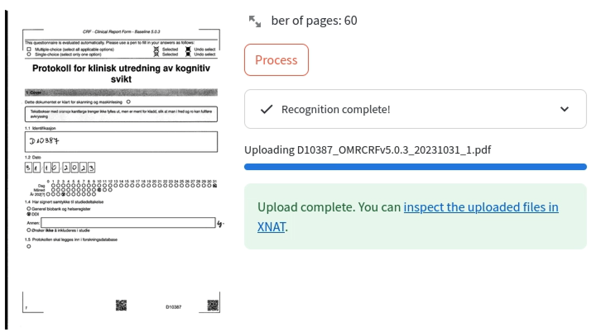

# OMR CRF Import

The OMR-CRF is a questionnaire that is generated using the [SDAPS](https://sdaps.org/) software to enable Optical Mark Recognition. To process filled CRFs and import their data into XNAT, we have developed a tool that automates the different stages as much as possible.

The CRF import functionality is available at the DDI Tools portal at `http://p96-podman:8181`, to access it, navigate to that address in the web browser and select "Import" item on the left navigation panel. 

## How to import OMR CRFs into XNAT

To import the CRF data and scanned documents into XNAT you need to follow a series of steps: 
- Scanning the CRF.
- Import the scan file into TSD.
- Navigate to the import tool.
- Provide the subject and visit data.
- Select the file uploaded in TSD for processing. 

### Scanning the CRF
SDAPS need a specific TIFF format file for it to process the optical mark recognition. The scanner must be set to 300 DPI black and white, multipage TIFF, compressed.

### Uploading the scan file into TSD
See the [TSD import user guide](../tsd/tsdimport.md) for importing files in case of any doubts.

### Importing the CRF with the Import tool
Once you have the scan available in TSD, use the Firefox browser to navigate to `http://p96-podman:8181` and click on the _Import_ item on the left navigation panel. 

#### XNAT login
The tool will then ask for your XNAT credentials so it can import the recognized data and upload the documents into XNAT. Provide your username and password and hit enter. If the credentials are correct the app will ask for the details about the CRF vist. 

#### CRF visit details
1. **Project**: Select the desired XNAT project from the dropdown list.
2. **Subject**: Type in the subject identifier.
3. **Visit Date**: Use the calendar tool to select the date of the assessment visit.
4. **Assessment Visit**: Pick the type of assessment visit from the dropdown menu.

You can modify these items at anytime, hit enter to apply the changes. 

#### CRF scan upload
With the visit details, the app will show the file input for you to upload the scan file. Click on the "Browse files" button to choose a scanned CRF document in TIFF format. The app will show a preview of the first page of the CRF and the detected page count.

#### Process and review
You can now click on the _Process_ button to start importing the CRF. The app will create the experiments and set their fields with the recognized marks from the CRF, and then split the different documents identified by QR codes and upload them into XNAT. 

The app will provide feedback about the different steps and progress. 

Once its finish, the app will provide a direct link to the subject to which the data was imported. OMR software is not infallible; SDAPS can make mistakes when deciding whether a checkbox is checked. Also, sometimes the person may have made a mistake when filling out the questionnaire. Therefore, it is very important to inspect the resulting data in XNAT that was set from the import process.

