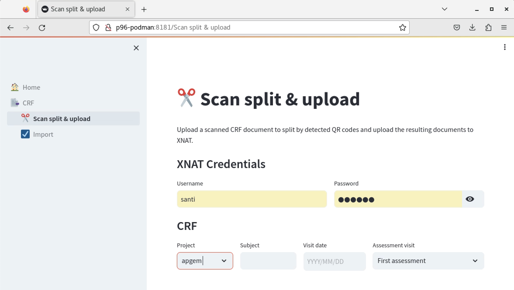

# CRF Splitter & Upload Tool User Documentation

The CRF Splitter is an app designed to upload scanned documents related to a patient visit (such as main CRF, MRI report, tests, etc.), split them by detected QR codes, and upload the resulting separate documents to XNAT. 

> ℹ️ The CRF Split & Upload tool only processes the actual scanned document to upload the associated scans to the XNAT subject. This tool doesn't create any experiments and associated data in XNAT

## Step 1: Import the scanned document into TSD
The very first step consists in uploading the file into TSD for it to become available in our servers. See the [user guide](tsdimport.md) for importing files in case of any doubts. 

## Step 2: Access the Application

1. **Navigate** to the DDI Tools web portal by entering `http://p96-podman:8181` in your web browser.
2. **Select** the "✂️Scan split & upload" option from the left navigation panel. 

   

## Step 3: Log In to XNAT

1. **Input** your XNAT username and password in the appropriate fields.
2. **Press** Enter to proceed.

## Step 4: Complete the CRF Form

1. **Project**: Select the desired XNAT project from the dropdown list.
2. **Subject**: Type in the subject identifier (the subject should already exist in the chosen project).
3. **Visit Date**: Use the calendar tool to select the date of the assessment visit.
4. **Assessment Visit**: Pick the type of assessment visit from the dropdown menu.

   

## Step 5: File Upload and Processing

1. **Click** the "Browse files" button to choose a scanned CRF document in TIFF format.
2. **Review** the page count and first page preview that appear after the file upload.

   
   
3. **Initiate** the splitting and upload operation by clicking the "Process" button.

   

## Step 6: Confirm Upload Status

1. **Verify** the success message that appears upon completion, which includes a link to the uploaded files in XNAT.

   

## Step 7: Inspect Uploaded Files in XNAT

1. **Click** the provided link to go to the XNAT subject page.
2. **Select** the `Manage Files` action.

3. **Locate** your uploaded documents in the SCANNED_DOCS folder, organized by visit.

   

By following these steps, you should be able to successfully upload and manage your scanned CRF documents.