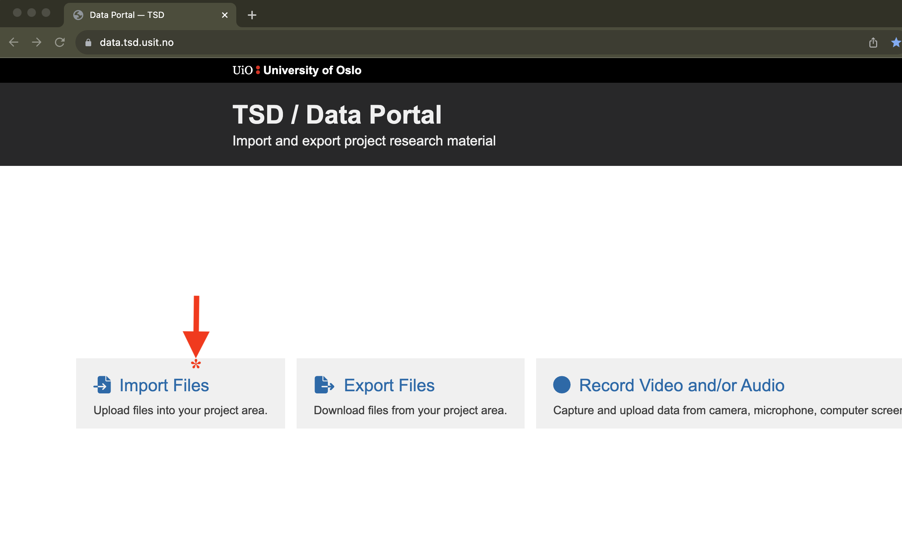
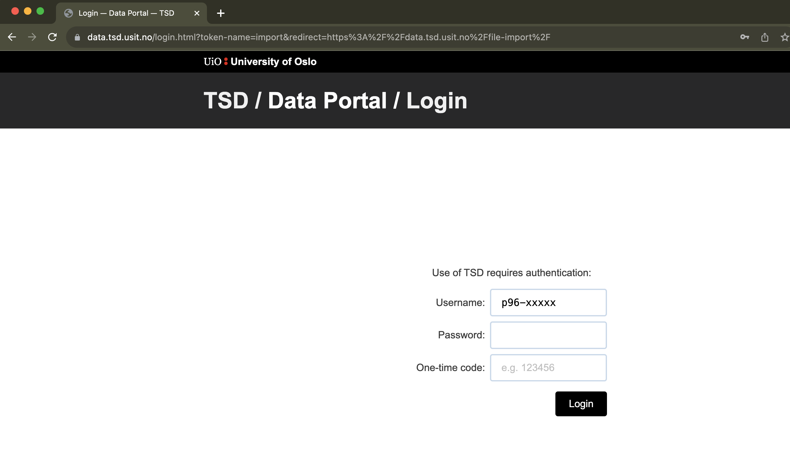
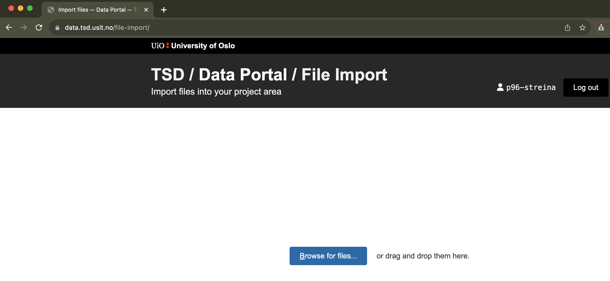
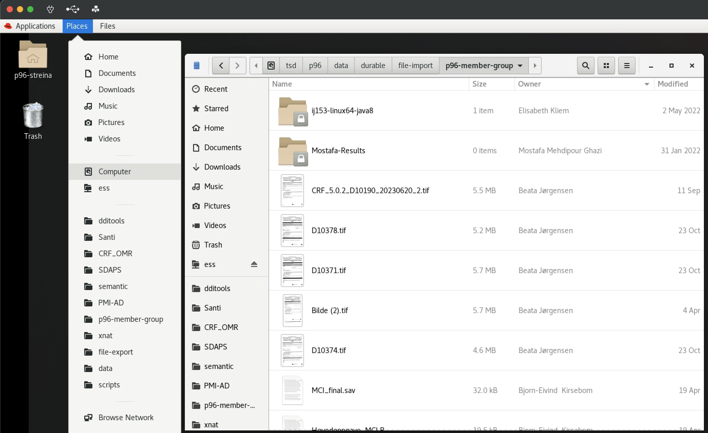
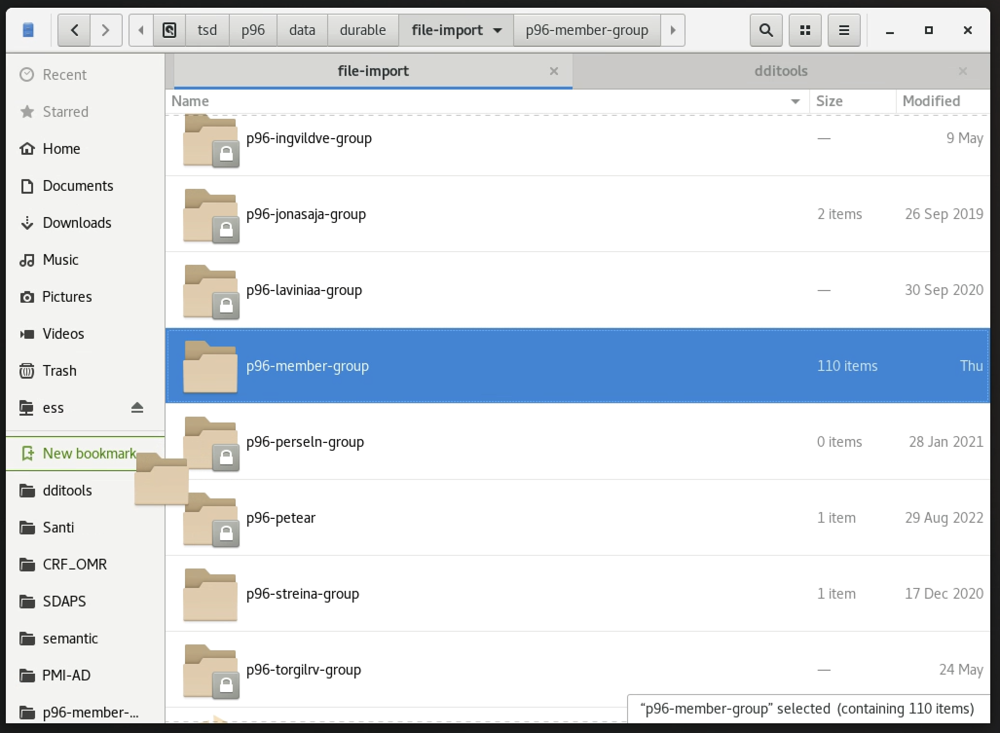
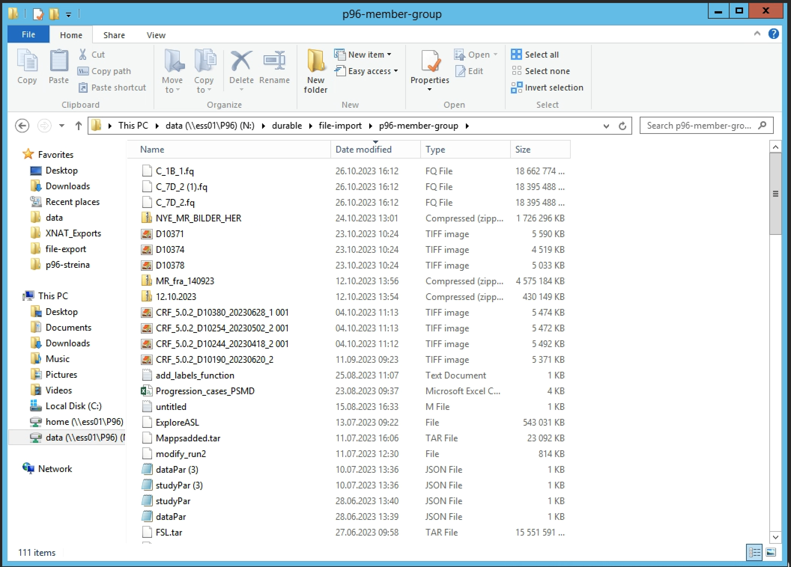

# TSD File Import

## Uploading files to TSD
To import files into TSD access **[https://data.tsd.usit.no/](https://data.tsd.usit.no/)** and click on _Import files_.

You will be prompted to enter your **TSD user credentials** and the One Time Passcode (OTP). 

After authenticating, you can either browse your computer for files, or drag them to the browser.
 

Once the import has finished, you can access your files in TSD from the main data folder. 

## Accessing files in TSD
Depending on which Virtual Machine (VM) you are logged in, the path and browsing interface differs a bit. 
### Linux (p96-rhel8-01-pool): 
The path to the file import folder is `/tsd/p96/data/durable/file-import/p96-member-group`. To access it, open the file browser from the `Places` toolbar menu and either navigate from the root folder or type in the navigation bar by holding the control (ctrl) key and typing l (ctrl + l).

To avoid doing these steps each time, it is advisable to create a bookmark for the folder. To do this, navigate to `/tsd/p96/data/durable/file-import`, locate the *p96-member-group* folder icon, click and drag it to the left pane, just bellow the default system bookmarks, until a green *New bookmark* indicator appears

### Windows (p96-win01-pool)
The path to the file import folder is `N:\durable\file-import\p96-member-group`. You can access it by clicking on the Windows menu, then This PC. The data folder has a shortcut on the left pane. From there browse to *file-import* and *p96-member-group*. You can also mark this folder as a favorite to have direct access. 
